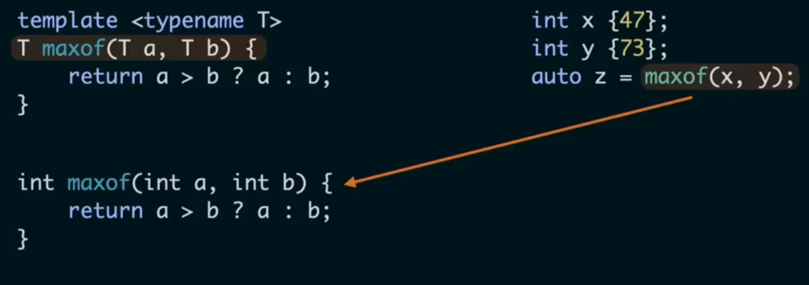

# C++ Topics

-   **RAII** (Resource Acquisition Is Initialization): Resources (memory, file handles, sockets, mutexes) are acquired in constructors and released in destructors. This C++ technique binds resource management to object lifetime. Guarantees deterministic cleanup.
        -   My Window class is a full RAII wrapper around SDL’s windowing and rendering resources. The constructor acquires the SDL subsystem, window, and renderer, and the destructor releases them deterministically. This ensures no leaks, no double frees, and predictable cleanup even if exceptions occur. I intentionally made the Renderer class a non‑owning façade because ownership belongs in Window, keeping the architecture clean and preventing lifetime ambiguity.
    -   **Lifetime**: Who owns an object? How long does it live? When does it die?
    -   **Move semantics**: Efficient transfer of ownership without copying.
    -   **Copy vs. move**: Copy duplicates state; move transfers resources and leaves the source in a valid but unspecified state.

-   **Value semantics**
    -   Objects own their data
    -   Copies are explicit
    -   Predictable and safe
    -   Great for math types (vectors, matrices, transforms)

-   **Reference semantics**
    -   Use references or pointers when you need aliasing
    -   Be explicit about mutability

-   **C++ compilation model**
    -   Templates must be visible at compile time → header‑only or inline definitions
    -   Headers declare; source files define
    -   Include guards or `#pragma once`
        -   `#pragma once` is a preprocessor directive placed at the top of header files to ensure they are included only once during a single compilation
    -   Linker errors often come from ODR violations (One Definition Rule - a program should contain only one definition for any specific entity (such as a variable, function, class, or template) within a single translation unit or the entire program)

-   **Const Correctness** (use to document intent and prevent accidental mutation)
        -   *const* on methods means no mutation of object state
        -   *const* references avoid copies
        -   *const* correctness improves API clarity and safety

-   **Error Handling**
    -   Exceptions for unrecoverable errors (e.g., `throw std::runtime\_error("Some error");`)
    -   `std::optional` for expected absence
    -   `std::expected` (C++23) for recoverable errors
    -   Assertions for invariants
    -   Minimize number of try/catch blocks

-   **Testing and Determinism**
    -   Deterministic stepping (makes it reproducible)
    -   Fixed‑timestep loops
    -   Reproducible seeds for randomness
    -   Regression tests for physics correctness

-   **Memory Layout and Performance**
    -   Contiguous memory (e.g., `std::vector`) is cache‑friendly
    -   Avoid unnecessary heap allocations
    -   Prefer stack allocation when possible
    -   Avoid virtual dispatch in hot loops

## Array vs List vs Vector

-   **std::array**
    -   fixed size
    -   use when you need efficient random access
-   **std::vector**
    -   variable size
    -   use when you need efficient random access
        -   because memory block is continuous, can access nth element easily
    -   use for insertion & deletion primarily at the end
        -   middle is troublesome because need to move everything else around it
-   **std::list**
    -   variable size
    -   use when random access not needed
        -   hard to access in middle because have to traverse pointers
    -   elements not stored contiguously in memory
    -   use when frequent insertion & deletion required in the middle
        -   just have to update a few pointers

## Pointers and References

-   **Pointers** used to store memory address of another variable
    -   If not pointing to a valid location, point to nullptr
    -   Reassigning a pointer to something else is called "receding the pointer"
    -   Access value at memory address using dereference \* or arrow operator ->

```cpp
int x = 10;

int \*ptr = &x;

\*ptr = 20; // x now 20
```

-   **Reference** used as alias for existing object, to avoid copying large objects
        -   Cannot be null
        -   Automatic dereferencing when accessing

```cpp
int x = 10;

int &ref = x;

ref = 20; // x now 20
```

-   **Smart Pointers** are classes which wrap around a pointer and automatically destroy themselves when they go out of scope
    -   Avoids memory leaks
    -   Dynamic lifetime
    -   Shared access

    -   Smart pointers are used to provide automatic memory management for dynamically allocated objects, which helps prevent memory leaks and other common pointer-related bugs that can occur with raw pointers. They do this by leveraging the RAII (Resource Acquisition Is Initialization) idiom, where the object's memory is released automatically when the smart pointer goes out of scope.
    -   **std::unique\_ptr**
        -   Exclusive ownership, can transfer by moving (not copying)
        -   Zero overhead compared to raw pointer
        -   Allows only one copy of that point to exist at a time, which is safer than a primitive pointer
        -   Perfect for simulation components with clear ownership
    -   **std::shared\_ptr**
        -   Multiple smart pointer objects sharing ownership of a single underlying resource/object
        -   Resource persists as long as one owner exists
        -   Reference counting overhead
        -   Use sparingly; only when ownership is genuinely shared
    -   **std::weak\_ptr**
        -   Non-owning reference to break cycles
        -   Useful in graph‑like structures (scene graphs, entity/component systems)
    -   In my engine architecture, I use unique\_ptr to express exclusive ownership of simulation components. The integrator is created in main() and ownership is transferred into the PhysicsSystem, and then into the Engine. This gives me deterministic lifetime, automatic cleanup, and prevents double frees or dangling pointers. Raw pointers can’t express ownership, so using unique\_ptr makes the architecture safer and clearer. I avoid shared\_ptr unless ownership is truly shared, which is rare in simulation systems.

**Unique pointer example:**

```cpp
#include <iostream>  
#include <memory>

struct Foo {  
Foo() { std::cout << "Foo constructed\\n"; }  
~Foo() { std::cout << "Foo destructed\\n"; }  
void bar() { std::cout << "Doing work\\n"; }  
};

int main()

{  
*// Preferred way: std::make\_unique (C++14)*  
std::unique\_ptr<Foo> p1 = std::make\_unique<Foo>();  
p1->bar();  
std::cout << "End of main\\n";

*// p1 goes out of scope here, Foo is automatically deleted*

return 0;

}

```

**Transferring ownership:**

```cpp
std::unique\_ptr<Foo> p2 = std::move(p1); *// p1 is now empty, p2 owns the object*
```

**Class member:**

```cpp
class MyClass {  
std::unique\_ptr<int> data;  
public:  
MyClass() : data(std::make\_unique<int>(10)) {}  
};
```

## Pre and post-increment

-   Use ++i by default (pre-increment), especially in for loops and when the original value of i is not needed in the current expression.
    -   This is generally considered a better practice as it is never less efficient and can be more efficient for user-defined types.

-   Use i++ (post-increment) only when the original value of i is specifically required in the current expression before it is incremented.

```cpp
float sum\_elements(float arr\[\], int n)

{

    float sum = 0.0;

    int i = 0;

    while (i < n)
        sum += arr\[i++\]; // Use current i to access array, then increment i
    return sum;

}
```

## Templates

-   **Templates** are the C++ feature that supports generic programming (code that works independent of type). When a function or class is used from the template, the compiler generates a **specialization**, specifically suited to the types specified in the caller (like a version of it that replaces T with that specified type). Template functions are more powerful than macros, hence used more often.
    -   Template classes are useful for manipulating containers of items, where the logic of the manipulation is independent of the type. Template classes are type-safe and type-agnostic.



The template function on top is a generic function that works for many types. It says:

-   “For *any* type T that supports operator> and copying, I can compute the max.”
    -   The compiler generates a concrete version of the function when you call it with a specific type.
    -   If you call `maxof(47, 73)`, the compiler instantiates `maxof<int>` which would essentially be the bottom function.
    -   If you call `maxof(std::string("a"), std::string("b"))`, it instantiates `maxof<std::string>`.

**Template class:**

```cpp
#include <iostream>

using namespace std;

template <typename T>

class Geek
{
public:
  T x;
  T y;

  // Constructor
  Geek(T val1, T val2) : x(val1), y(val2){
  }

  // Method to get values
  void getValues(){
      cout << x << " " << y;
  }

};

int main()

{
    Geek<int> intGeek(10, 20);
    Geek<double> doubleGeek(3.14, 6.28);

    intGeek.getValues();

    cout << endl;
    doubleGeek.getValues();

    return 0;
}
```

## Shallow Copy vs Deep Copy

In C++, the difference between shallow copy and deep copy centers on how dynamically allocated memory (pointers) is handled when one object is copied into another.
-   **Shallow Copy**: Copies the member values as they are. If a member is a pointer, it copies the address, meaning both objects point to the same memory.
    -   Use for simple classes containing only "value" types (like int, double, char) where no dynamic memory is involved.
-   **Deep Copy**: Creates a new memory allocation for the copy and duplicates the actual data. Each object owns its own independent resource.
    -   Essential for classes that manage resources (like raw pointers, file handles, or network sockets) to prevent memory corruption when objects are passed around.

## Rules of 3 and 5

-   **C++ rule of 3**: \[Legacy\] Any class for which there is a desire for a custom user defined:
    -   Destructor
    -   Copy constructor
    -   Copy assignment operator

… Almost certainly requires defining all three

The rule exists because if you manually manage a resource (like dynamic memory using new\[\]/delete\[\], file handles, or network sockets), the compiler's implicitly-generated copy constructor and copy assignment operator perform a shallow copy. A shallow copy just copies the raw pointer or handle value, leading to issues like double-deletion errors or memory leaks when the copied objects are destroyed.

-   **C++ rule of 5**: Any class for which move semantics are desired needs all five special member functions:
    -   Destructor
    -   Copy constructor
    -   Copy assignment operator
    -   Move constructor
    -   Move assignment operator

**Example of each function in action:**

```cpp
int main()

{
    // Constructor
    MyClass original("Hello");

    // Copy Constructor: creates a new object from an existing one
    MyClass copied = original; // or could do MyClass copied(original);

    // Copy Assignment Operator: assigns an existing object to another existing object
    MyClass another("World");
    another = original;

    // Move Constructor: creates a new object by "stealing" resources from a temporary object (rvalue)
    MyClass moved(std::move(original));

    // After this, 'original' is in a valid but unspecified state (its data pointer is nullptr)

    // Move Assignment Operator: moves resources from a temporary object to an existing object
    MyClass final\_obj("Initial");
    final\_obj = MyClass("Temporary"); // MyClass("Temporary") is an rvalue (temporary object)

    // Passing by value invokes the Copy Constructor (for lvalues)
    functionByValue(copied);

    // Destructors: automatically called when objects go out of scope

    // Order of destruction is reverse of creation: final\_obj, moved, another, copied
    return 0;
}
```

## Rule of Zero

A common modern approach is the **Rule of Zero**. This guideline suggests that most classes should avoid managing resources directly and instead use standard library types (like smart pointers or containers like `std::vector` and `std::string`) to handle ownership. In such cases, the compiler-generated default functions work correctly, and no special member functions need to be explicitly defined.

If you don't need to manually delete a pointer or close a file handle in the destructor, don't write the destructor at all. It's okay to write a custom constructor.

## Abstraction, Encapsulation, Inheritance, Polymorphism

-   **Abstraction** – showing only essential object features while hiding complex implementation details
-   **Encapsulation** – bundling object attributes and methods within a class unit, controlling access using private data members and public methods
-   **Inheritance** – Subclass deriving properties and behaviors of superclass (as opposed to **composition** – not using inheritance)
-   **Polymorphism** – “many forms” enables objects of different classes to be treated of objects of a common base class:
    -   **Method overriding** (dynamic) – Subclasses with specific method implementation for a method defined in superclass
        -   Considered dynamic because specific method determined at runtime based on the object’s type
    -   **Method overloading** (static) – Multiple methods with same name within same class, each with different input parameters
        -   Considered static because compiler can look at method call and know which method signature matches call

## Constants

```cpp
constexpr (preferred in modern C++) - guarantees compile time evaluation

constexpr int MAX\_USERS = 100;

constexpr double PI = 3.14159;

enum class (for grouped constants) - type-safe scoped sets of constants

enum class Status { OK, Error, Pending };

const (legacy C++) - read only variable, does not guarantee compile time evaluation

const int MAX\_BUFFER = 1024;

#define (macro, legacy C++) - not recommended as it ignores scope and type checking

// No type safety, no scope

#define PI 3.14159
```

## Other concepts

-   The **virtual** keyword in C++ is the cornerstone of runtime polymorphism. Its primary purpose is to ensure that when a function is called through a pointer or reference to a base class, the version of the function in the actual derived class's object is executed, rather than the base class's version

```cpp
#include <iostream>

class Animal {
public:
    // Declare the function as virtual in the base class
    virtual void makeSound() {
        std::cout << "Generic animal sound" << std::endl;
    }

    // It is a best practice to make the base class destructor virtual
    virtual ~Animal() = default;
};

class Dog : public Animal {
public:
    void makeSound() override { // Use 'override' keyword (C++11) for clarity
        std::cout << "Woof! Woof!" << std::endl;
    }
};

class Cat : public Animal {
public:
    void makeSound() override {
        std::cout << "Meow!" << std::endl;
    }
};

int main() {
    Animal\* myAnimal;
    // Point to a Dog object
    myAnimal = new Dog();

    // Calls Dog's makeSound() because it's virtual (runtime polymorphism)
    myAnimal->makeSound();

    delete myAnimal; // Calls both Dog and Animal destructors
    std::cout << "---" << std::endl;

    // Point to a Cat object
    myAnimal = new Cat();

    // Calls Cat's makeSound() because it's virtual
    myAnimal->makeSound();

    delete myAnimal;

    return 0;
}
```

-   The **inline** keyword in C++ serves two main purposes: it is a hint to the compiler for optimization and a mechanism to manage the One Definition Rule (ODR) for functions and variables defined in header files.
    -   Performance Optimization (Hint): The original purpose was to suggest to the compiler that it should replace the function call with the actual body of the function's code at compile time, a process called "inline expansion". This avoids the overhead associated with a normal function call (like managing the call stack, passing arguments, and returning control), potentially leading to faster execution, especially for small, frequently called functions.
        -   Note: The inline keyword is only a suggestion, not a command. Modern compilers often decide for themselves whether to inline a function, even without the keyword, and may ignore the request if the function is too large or complex (e.g., contains loops or recursion).
    -   Linking (ODR Management): In modern C++, the more important role of inline is to relax the One Definition Rule, which normally states a function can only be defined once across all source files. Marking a function as inline allows its identical definition to appear in multiple translation units (source files) without causing linker errors. This makes it safe and practical to define functions entirely within header files, which is essential for template libraries and class member functions defined within the class body.

```cpp
// utilities.h

#include <iostream>

// The 'inline' keyword allows this function to be defined in a header
// file and included in multiple source files without linker errors.

inline int add(int a, int b)
{
    return a + b;
}

// Member functions defined within the class body are implicitly inline
class MathOps {
public:
    int multiply(int a, int b) { // Implicitly inline
        return a \* b;
    }
};

// main.cpp
#include "utilities.h" // Includes the definition of add() and MathOps

int main()
{
    int num1 = 10, num2 = 20;

    // When add() is called, the compiler \*may\* replace this call
    // with the actual code (return 10 + 20;) at this point.
    int sum = add(num1, num2);
    MathOps ops;

    // Similarly for the multiply member function
    int product = ops.multiply(num1, num2);

    std::cout << "Sum: " << sum << ", Product: " << product << std::endl;

    return 0;
}
```

-   Using aliases like using `MyType = std::string;` (type aliasing) or creating wrapper classes (type **overloading**) improves code readability, enables stronger semantic intent, and eases future maintenance. It allows developers to replace generic types with domain-specific names, making code self-documenting and facilitating easier changes if the underlying data type needs to change later.
    -   Improved Readability and Semantics: Replacing `std::string` with Username or FilePath makes the code's purpose immediately clear.
    -   Easier Maintenance: If you need to change MyType from `std::string` to a custom string class, you only update the alias definition, not every instance in the codebase.
    -   Template Specialization: Using unique types allows for specialized behavior in templates.
    -   Code Documentation: It acts as documentation, explaining what the string is supposed to represent (e.g., distinguishing a SessionID from a UserEmail)

-   **size\_t** represents an unsigned integer type that is used specifically for sizes and counts, and its size is platform-dependent, not inherently tied to long int or only for std::vector sizes.
    -   Purpose: size\_t is the type returned by the sizeof operator. It is guaranteed to be large enough to hold the size in bytes of any object that the system can theoretically support or allocate.
    -   Platform Dependency: Its actual size (e.g., 32-bit or 64-bit) is determined by the compiler and the target system's architecture to ensure portability across different platforms.
    -   Unsigned Nature: It is always an unsigned integer type, meaning it can only represent non-negative values. This is logical because an object's size or an array index cannot be negative.


**Use std::vector<Car> when:**

-   Car is small and cheap to copy/move.
-   You don’t need polymorphism.
-   You don’t need dynamic lifetime.
-   You want cache-friendly contiguous storage.

**Use std::vector<std::unique\_ptr<Car> when:**

-   Car is expensive or impossible to copy.
-   You need polymorphism (`vector<unique\_ptr<Base>>`).
-   Objects must not be relocated.
-   Ownership must be explicit and exclusive.
-   You want to transfer objects between systems/subsystems.

## Unique pointer movement

Moving a std::unique\_ptr transfers ownership of the managed object from one pointer to another. After the move, the source pointer becomes nullptr, and the destination pointer becomes the sole owner of the object. The object itself is not moved or copied—only the ownership is transferred.

## Passing by value vs reference
Passing by value means the function receives its own copy of the argument. Passing by reference means the function receives an alias to the original object, allowing the function to modify it (unless the reference is const) and avoiding the cost of copying large or non‑copyable objects.

## Pointer and Reference behavior

***Given a raw pointer***

```cpp
int\* p
```

***Explain what happens when you do:***

```cpp
int x = 10;

p = &x;
```

***and what happens if x goes out of scope.***

This means the pointer p now stores the memory address of x. Dereferencing p with \*p would give the value 10.

If x goes out of scope, the memory address that held x becomes invalid, so the address of p no longer refers to a valid object (dangling pointer) which is dangerous.

A smarter solution would be this, where the lifetime is now tied to the smart pointer rather than the stack variable x:

```cpp
std::unique\_ptr<int> p = std::make\_unique<int>(x);
```

## Dangling Pointer Example

***Explain why this code is dangerous:***

```cpp
int\* makeInt()

{
    int x = 5;
    return &x;
}
```

The function returns the address of a local stack variable. When the function returns, that variable is destroyed, so the pointer now refers to memory that no longer holds a valid object. This creates a dangling pointer, and dereferencing it results in undefined behavior.

Alternatives:

- Allocate on the heap (but the caller must delete it):

```cpp
int\* makeInt()
{
    return new int(5);
}
```

- Return value:

```cpp
int makeInt()

{
    return 5;
}
```

- Use unique pointer:

```cpp
std::unique\_ptr<int> makeInt()
{
    return std::make\_unique<int>(5);
}
```
 
## Pointer vs Reference vs Value

```cpp
void foo(int\* p);
```

A pointer parameter receives the memory address of an integer. Dereferencing (\*p) accesses or modifies the original value.

-   Appropriate to use when:
    -   The argument may be null (pointers can express “no object”).
    -   You need to rebind the pointer (e.g., change what it points to).
    -   You are working with APIs that require pointer semantics.
    -   You want to show explicit indirection.
-   Notes:
    -   Pointers allow nullability, which references do not.
    -   Pointers require manual dereferencing, which affects readability.
    -   Pointers can be reseated; references cannot.

```cpp
void foo(int& r);
```

A reference is an alias to the original variable. Modifying r modifies the caller’s variable.

-   Appropriate to use when:
    -   You want to modify the caller’s value.
    -   You want pointer‑like semantics without pointer syntax.
    -   You want to avoid copying large objects.
    -   You want to guarantee non-null access.
-   Notes:
    -   References cannot be null (barring undefined behavior).
    -   References cannot be reseated.
    -   References improve readability and safety over pointers.
    -   References are the idiomatic choice in modern C++ for “modify the caller.”

```cpp
void foo(int x);
```
Passing by value creates a copy of the argument. Modifying x does not affect the caller.

-   Appropriate to use when:
    -   The value is small and cheap to copy (like int).
    -   You want isolation from the caller’s data.
    -   You want to avoid aliasing or side effects.
-   Notes:
    -   Passing by value is often optimized (copy elision, register passing).
    -   It is the safest form because the function cannot affect the caller.
    -   It is preferred for small, trivially copyable types.

## Reseating

To *reseat* something means to make it “sit somewhere else”—in other words, to make it refer to a different object.

A **pointer can be reseated**. You can change the address it stores at any time.

```cpp
int a = 1;

int b = 2;

int\* p = &a;   // p points to a

p = &b;        // p is reseated; now it points to b
```

A **reference cannot be reseated**. Once bound, it is permanently an alias to the original object.

```cpp
int a = 1;

int b = 2;

int& r = a;   // r refers to a

r = b;        // assigns b’s value \*into a\*; does NOT reseat r
```

## Stack vs Heap (Memory)

***What is difference between:***

```cpp
int a = 5;               // stack

int\* b = new int(5);     // heap
```

The first creates an integer variable a with a value of 5, which lives on the stack. **Stack memory** used for static, temporary, and small data with known compile-time sizes. Its lifetime is tied to the scope it's declared in, and there is no manual memory management. Use this almost always, unless dynamic allocation needed.

The second allocates an int on the heap, where b stores the address of that heap memory. **Heap memory** is a large pool of memory used for dynamic allocation — memory whose lifetime you control manually. This memory persists until it's manually freed:

```cpp
delete b;
```

Smart pointers are dynamic since you can transfer ownership before a given scope ends, or have shared ownership (dynamic because lifetime of object not tied to its scope).

***Explain when you would choose stack allocation vs. heap allocation***

Only need heap allocation if you need dynamic lifetime (e.g., outliving current scope)

***Explain what happens if you forget to delete a heap allocation.***

***Explain why unique\_ptr solves this problem.***

If the heap allocation was not deleted, this would create a long-term memory leak. Instead of manual deletion, a better solution is to create a std::unique\_ptr which automatically frees itself and deletes the object when it goes out of scope (it still lives on the dynamic heap):

```cpp
#include <memory>

std::unique\_ptr<int> b = std::make\_unique<int>(5);
```

## Vectors
***Explain why std::vector stores elements contiguously and why that matters for performance.***

std::vector stores elements contiguously so it can provide true O(1) random access and excellent CPU cache locality. This makes iteration and algorithms like std::sort extremely fast. The tradeoff is that inserting or removing in the middle is expensive because elements must be shifted.

## Null pointers and memory leaks and out-of-bounds
***Why might this crash?***

```cpp   
int\* p = nullptr;

\*p = 10;
```

p is initialized to nullptr, which means it does not point to a valid memory location. Dereferencing a null pointer (`\*p = 10;`) attempts to write to address 0, which is invalid and results in undefined behavior — usually a crash. To fix this, the pointer must refer to a valid int object before dereferencing.

***Why might this leak memory?***

```cpp
int\* p = new int(5);

// no delete
```

`new int(5)` allocates an int on the heap, and the pointer p becomes the only reference to that memory. Since the code never calls delete p;, the allocated memory is never freed. When p goes out of scope, only the pointer is destroyed, not the heap allocation, resulting in a memory leak. Stack variables and smart pointers clean up automatically, but raw new requires a matching delete.

***What’s wrong with this?***

```cpp
std::vector<int> v;

int& r = v\[0\];
```

The vector is empty, so it contains no elements. Accessing v\[0\] is out‑of‑bounds and results in undefined behavior. Binding a reference to v\[0\] is invalid because there is no element at index 0. A reference must always refer to a valid object, so this code is incorrect. If v were {1, 2, 3}, the second line would work.

***What’s the difference between:***

```cpp
Thing t1;

Thing t2 = t1;
```
  
***and***  
  
```cpp
Thing t3 = std::move(t1);
```

In the first case (`Thing t2 = t1;`), the copy constructor is invoked, creating a new object whose state is a duplicate of t1.

In the second case (`Thing t3 = std::move(t1);`), the move constructor is invoked, which transfers resources from t1 into t3. After the move, t1 remains a valid object but its internal state is unspecified — it no longer owns the resources that were moved.

## Inheritance vs Composition

To avoid the complexity of inheritance (subclasses/superclasses), the primary alternative is **Composition** (or "favoring composition over inheritance"). This approach builds complex types by combining simpler, independent objects rather than inheriting behaviors, often using Delegation to pass tasks to specialized components.

But if using inheritance, this is an example:

```cpp
#include <iostream>
#include <string>

// Define the base class 'Vehicle'

class Vehicle {
protected:
    std::string brand; // brand of the vehicle
    std::string color; // color of the vehicle

public:
    // Constructor to initialize attributes
    Vehicle(std::string brand\_name, std::string color\_name)
        : brand(brand\_name), color(color\_name) {}

    // Method to display common attributes
    void display\_vehicle\_info() const {
        std::cout << "Brand: " << brand << ", Color: " << color << std::endl;
    }
};

// Define the derived class 'Car'
// 'Car' publicly inherits from 'Vehicle'

class Car : public Vehicle {
private:
    int doors; // number of doors specific to 'Car'

public:
    // Constructor for Car, which calls the Vehicle constructor

    Car(std::string brand\_name, std::string color\_name, int num\_doors)
        : Vehicle(brand\_name, color\_name), doors(num\_doors) {}

    // Method to display all attributes (inherited and unique)
    void display\_car\_info() const {
        display\_vehicle\_info(); // Accessing inherited method
        std::cout << "Doors: " << doors << std::endl; // Accessing unique attribute
    }
};

int main() {
    // Create an object of the derived class 'Car'
    Car myCar("Ford", "Red", 4);

    // Access inherited and unique attributes/methods via the Car object
    std::cout << "My car details:" << std::endl;
    myCar.display\_car\_info();

    return 0;
}
```

## Access Specifiers

In C++, the **public, protected,** and **private** keywords are **access specifiers** that control the visibility and accessibility of class members (variables and functions) to different parts of a program. 

| **Access Specifier** | **Accessible from Inside the Same Class?** | **Accessible from Derived Classes?** | **Accessible from Outside the Class (via object)?** |
| --- | --- | --- | --- |
| **public** | Yes | Yes | Yes |
| **protected** | Yes | Yes | No |
| **private** | Yes | No | No |

-   **public**: Use for methods and properties that are intended for general use by other parts of the program (e.g., getter/setter methods for controlled access to private data).
-   **protected**: Use for internal helper methods or data that derived classes might need to access or modify, but which should remain hidden from the outside world.
-   **private**: Use for implementation details and data that should be completely hidden to enforce encapsulation and data integrity, ensuring that only the class itself can manage its internal state. 

## Static Methods

In C++, a static method belongs to the class as a whole, rather than to a specific instance (object) of the class. This means you can call a static method without creating an object of the class.